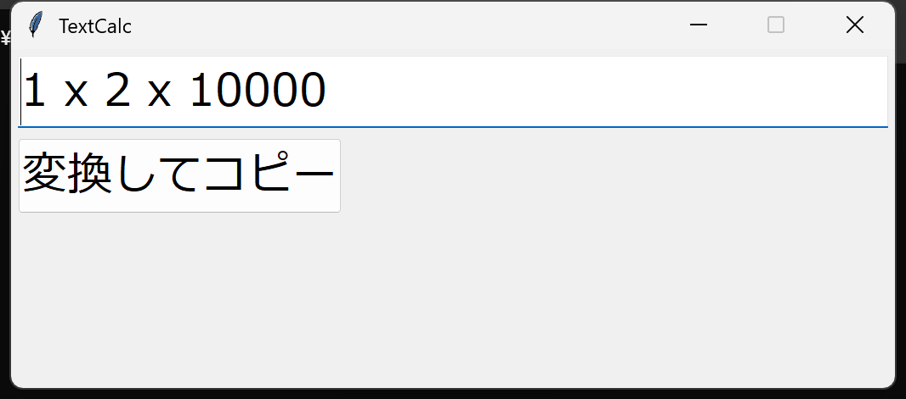
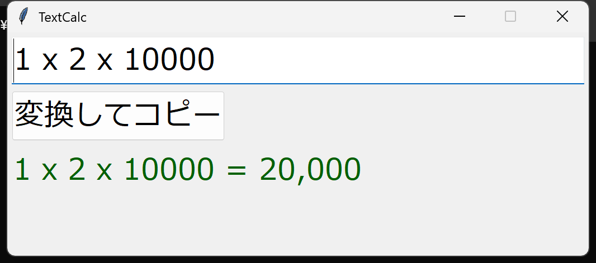
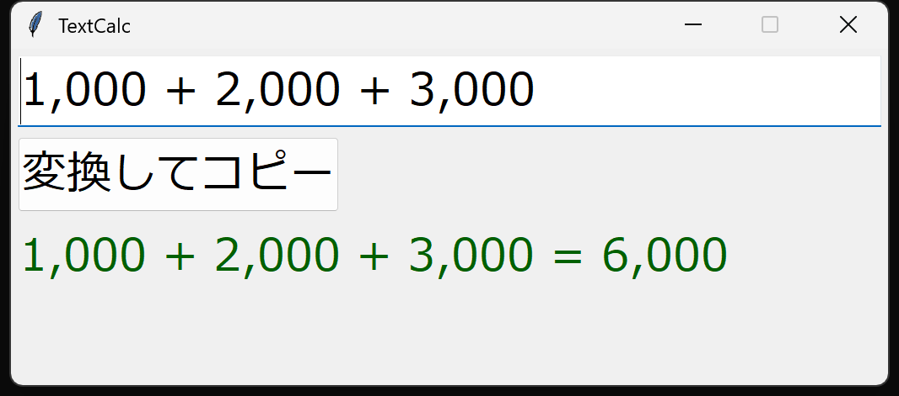
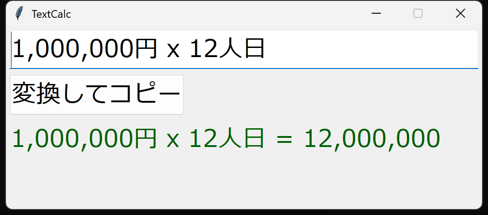

# TextCalc

テキストに含まれる数式を抽出して計算し、結果をクリップボードにコピーするツールです。

## スクリーンショット

**起動直後** — クリップボードの先頭行が自動入力されます



**変換後** — 式と結果がステータスに表示され、クリップボードにコピーされます



**カンマ区切り数値** — 桁区切りカンマは自動的に無視されます



**日本語混じりのテキスト** — 数字と演算子だけを抽出して計算します



## 使い方

1. 計算したいテキストをクリップボードにコピーしてから起動する（自動入力される）
2. または起動後に入力欄に式を直接入力する
3. **Enter** キーまたは「変換してコピー」ボタンを押す
4. 結果がステータスに表示され、クリップボードに `式 = 結果` の形式でコピーされる

## 対応する記法

| 種類 | 使用できる文字 |
|------|--------------|
| 掛け算 | `*` `x` `X` `×` `＊` `ｘ` `Ｘ` |
| 割り算 | `/` `／` `÷` |
| 足し算・引き算 | `+` `-` |
| 括弧 | `(` `)` `（` `）` |
| 桁区切り | `,` `_` `·`（計算時に無視） |

## 実行要件

- Windows 10 / 11
- Python 3.x（tkinter 付属）

## 起動方法

```
pythonw textcalc.pyw
```
